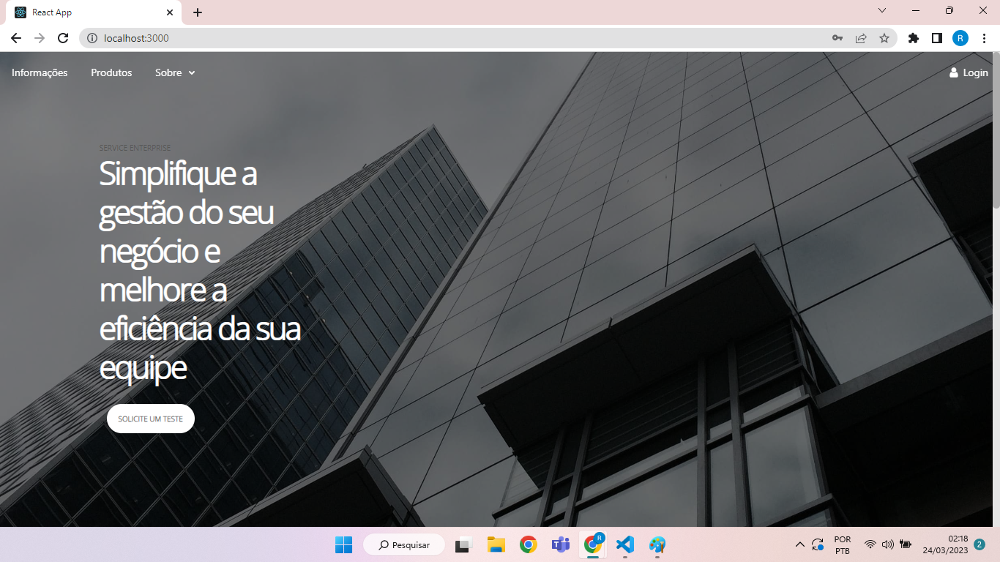

# ERP-PLUS
<p align="center">ERP dividido em módulos para atender todos os departamentos de um empresa</p>

<h4 align="center"> 
	🚧  React Select 🚀 Em construção...  🚧
</h4>

### Features

## Modulo de estoque
-Status: Em desenvolvimento
- [x] Cadastro de items ou produtos
- [x] Definição de criticidade de items em estoque
- [x] Histórico de movimentações
- [x] Inventário
- [ ] Controle de armazém
- [ ] DashBoard 

## Modulo de gestão em departamento pessoal
- Status: Não iniciado

## Modulo de gestão em recursos humanos
- Status: Não iniciado

## Modulo de gestão de compras
- Status: Não iniciado

<h1 align="center">
  
</h1>

## link de teste
https://erp-plus-front-end-2qpn.vercel.app/


### Pré-requisitos

Visite o repositório para fazer o download do back-end
https://github.com/RailsonPinheiro2030/Erp_plus_APIs


### 🎲 Rodando o Front End

```bash
# Clone este repositório
$ git clone <https://github.com/RailsonPinheiro2030/Erp_plus_front_end>

# Acesse a pasta do projeto no terminal/cmd
$ cd Erp_plus_front_end


# Instale as dependências
$ npm install


# Crie um arquivo .env e coloque a variável de ambiente REACT_APP_BASE_URL que recebe o ip e a porta do servidor back-end
REACT_APP_BASE_URL = 'https://localhost:5000/'


# Execute a aplicação em modo de desenvolvimento
$ npm start


# O servidor inciará na porta:3000 - acesse <http://localhost:3000>
```


### 🛠 Tecnologias

As seguintes ferramentas foram usadas na construção do projeto:

- [Node.js](https://nodejs.org/en/)
- [React](https://pt-br.reactjs.org/)
- [Redux-toolkit](https://redux-toolkit.js.org/introduction/getting-started)
- [React-semantic-ui](https://react.semantic-ui.com/)
- [React-suite](https://rsuitejs.com/)
